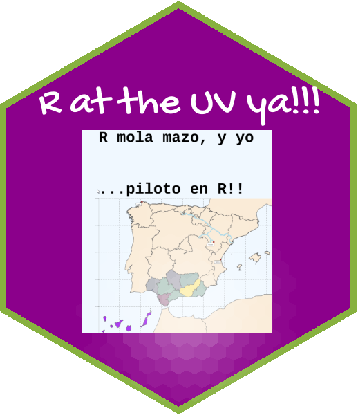

<!-- README.md is generated from README.Rmd. Please edit that file -->

<!-- badges: start -->

<!-- badges: end -->

## Welcome

Este repositorio sirve para construir la página web de la asignatura **Programación y manejo de datos en la era del Big Data**, con código 36494, que se impartirá durante el curso académico 2026-27 en el [Grado de Economía](https://www.uv.es/uvweb/universidad/es/estudios-grado/oferta-grados/oferta-grados/grado-economia-1285846094474/Titulacio.html?id=1285847455792) de la Universitat de València.

La **página web** del curso está aquí: <https://perezp44.github.io/intro-ds-26-27-web/>

 

-- Pedro J. Pérez

